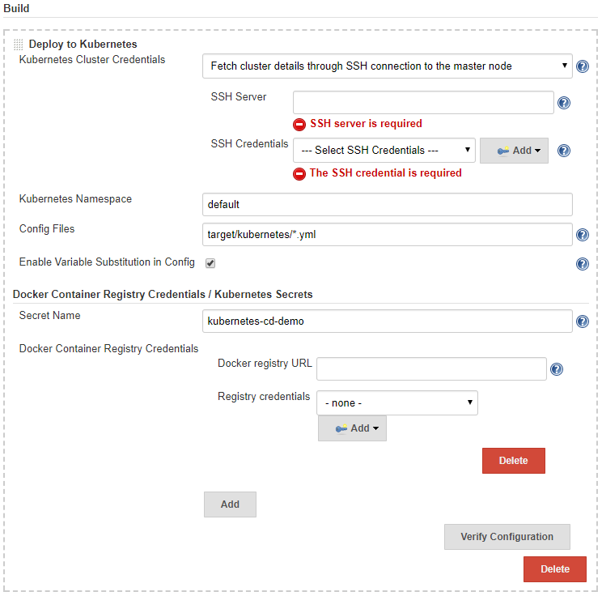

# Kubernetes Continuous Deployment Plugin

A Jenkins plugin to deploy resource configurations to a Kubernetes cluster.

It provides the following features:

* Fetch the cluster credentials from the master node via SSH. You may also configure it manually.
* Variable substitution for the resource configurations, allowing you to do dynamic resource deployment.
* Docker login credentials management for the private Docker registry.

## Prerequisites

* A Kubernetes cluster.
* Kubernetes resource configurations to be deployed.

## Configure the Plugin



1. Within the Jenkins dashboard, select a Job and then select Configure
1. Scroll down and click the "Add build step" dropdown
1. Select "Deploy to Kubernetes"
1. Select how you would provide the "Kubernetes Cluster Credentials", i.e., [**kubeconfig**](https://kubernetes.io/docs/tasks/access-application-cluster/authenticate-across-clusters-kubeconfig/).
   This may be either one of
   * Authenticate with kubeconfig file in workspace. Fill in the path to the `kubeconfig` file available in 
      the Jenkins workspace.
   * Fetch cluster details through SSH connection to the master node. Fill in the SSH credentials to the master node,
       and the plugin will pull the **kubeconfig** from `~/.kube/config` from the master node.
   * Fill credentials details directly. Manually copy / paste the contents from existing **kubeconfig**.
1. Fill in the namespace in which you want to deploy the resources. By default this will be `default`.
1. Fill in the "Config Files" with the configuration file paths. Split multiple entries with comma (`,`). 
   [Ant glob syntax](https://ant.apache.org/manual/dirtasks.html#patterns) is supported for path patterns.
1. By checking "Enable Variable Substitution in Config", the variables (in the form of `$VARIABLE` or `${VARIABLE})
   in the configuration files will be replaced with the values from corresponding environment variables before
   they are fed to the Kubernetes management API. This allows you to dynamically update the configurations according
   to each Jenkins task, for example, using the Jenkins build number as the image tag to be pulled.
1. If your Kubernetes resources being deployed need to pull images from private registry, you can click the
   "Docker Container Registry Credentials / Kubernetes Secrets..." button and configure all the required registry
   credentials.
   * Secret Name: the name of the secret that will be generated or updated if exists. If left blank, a unique name will
      be generated. The name will be exposed as environment variable `KUBERNETES_SECRET_NAME` and you may reference it
      in your configuration with the "Enable Variable Substitution in Config" option turned on.

      ```yaml
      apiVersion: extensions/v1beta1
      kind: Deployment
      metadata:
        name: sample-k8s-deployment
      spec:
        replicas: 1
        template:
          metadata:
            labels:
              app: sample-k8s-app
          spec:
            containers:
            - name: sample-k8s-app-container
              image: <username or registry URL>/<image_name>:<tag(maybe $BUILD_NUMBER)>
              ports:
              - containerPort: 8080
            imagePullSecrets:
            - name: $KUBERNETES_SECRET_NAME
      ```
   * Docker Container Registry Credentials: add one entry for each of the required private registry. If it is DockerHub,
      you may left the "Docker registry URL" as blank. Add or select the "Registry credentials" with type "Username
      with password".

   You may also prepare the [Kubernetes Secrets](https://kubernetes.io/docs/concepts/configuration/secret/) beforehand.
   and reference the secret from your resource configurations directly.

## Pipeline Support

The kubernetes-cd plugin provides function `kubernetesDeploy` for [Jenkins Pipeline](https://jenkins.io/doc/book/pipeline/)
support. You can go to the *Snippet Generator* page under *Pipeline Syntax* section in Jenkins, select
"kubernetesDeploy: Deploy to Kubernetes" from the "Sample Step" dropdown, and it will provide you configuration
interface for the plugin. After filling the entries and click "Generate Pipeline Script" button, you will get the
sample scripts which can be used in your Pipeline definition.

```groovy
kubernetesDeploy(
        credentialsType: 'KubeConfig',
        kubeConfig: [path: '<path-to-the-kubeconfig-in-the-workspace>'],

        namespace: '<kubernetes-namespace>',
        configs: '<ant-glob-pattern-for-resource-config-paths>',
        enableConfigSubstitution: false,

        secretName: '<secret-name>',
        dockerCredentials: [
                [credentialsId: '<credentials-id-for-docker-hub>'],
                [credentialsId: '<credentials-id-for-other-private-registry>', server: '<registry-url>'],
        ],
)
```

The parameters can be divided into the following groups, which you may configure as required.

* Kuberntes Cluster Credentials

   The `credentialsType` identifies the source you selected. You may choose one of the following types:
   
   * Authenticate with kubeconfig file in workspace
   
      ```groovy
      kubernetesDeploy(
              credentialsType: 'KubeConfig',
              kubeConfig: [path: '<path-to-the-kubeconfig-in-the-workspace>'],
              ...
      )
      ```
   * Fetch cluster details through SSH connection to the master node
   
      ```groovy
      kubernetesDeploy(
              credentialsType: 'SSH',
              ssh: [sshCredentialsId: '<credential-id>', sshServer: '<server-address>'],
              ...
      )
      ```
   * Fill credentials details directly
   
      ```groovy
      kubernetesDeploy(
              credentialsType: 'Text',
              textCredentials: [
                  serverUrl: '<server-url>',
                  certificateAuthorityData: '<certificate-authority-data>',
                  clientCertificateData: '<client-certificate-data>',
                  clientKeyData: '<client-key-data>',
              ],
              ...
      )
      ```
* Basic config for the deployments.

   ```groovy
   kubernetesDeploy(
           ...
           namespace: '<kubernetes-namespace>',
           configs: '<ant-glob-pattern-for-resource-config-paths>',
           enableConfigSubstitution: true,
           ...
   )
   ```
   * `namespace` defaults to `default` if omitted
   * `enableConfigSubstitution` defaults to `true`
   
* Docker Container Registry Credentials / Kubernetes Secrets

   ```groovy
   kubernetesDeploy(
           ...
           secretName: '<secret-name>',
           dockerCredentials: [
               [credentialsId: '<credentials-id-for-docker-hub>'],
               [credentialsId: '<credentials-id-for-other-private-registry>', server: '<registry-url>'],
           ],
   )
   ```

   * A unique `secretName` will be generated if omitted, and you need to reference it with variable 
      `$KUBERNETES_SECRET_NAME` in your resource configurations.
