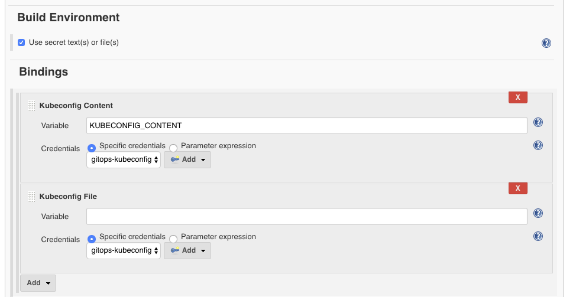

# Kubernetes Continuous Deploy Plugin

A Jenkins plugin to deploy resource configurations to a Kubernetes cluster.

It provides the following features:

* Fetch the cluster credentials from the master node via SSH. You may also configure it manually.
* Variable substitution for the resource configurations, allowing you to do dynamic resource deployment.
* Docker login credentials management for the private Docker registry.
* No need to install the `kubectl` tool on the Jenkins slave nodes.

## Breaking changes in version 1.0.0

This plugin depends on [Kubernetes & OpenShift 3 Java Client](https://github.com/fabric8io/kubernetes-client). To apply more features of Kubernetes in this plugin, we have to upgrade the version of the sdk. However the new version of the sdk does not support some legacy Kubernetes api versions any more. **If you want to upgrade to version 1.0.0, please update your Kubernetes resource files**. Following API objects are no more support extensions group, please change them to apps group.

- DaemonSet
- Deployment
- ReplicaSet

## Prerequisites

* A Kubernetes cluster.
* Kubernetes resource configurations to be deployed.

## Configure the Plugin


1. Within the Jenkins dashboard, select a Job and then select Configure
1. Scroll down and click the "Add build step" dropdown
1. Select "Deploy to Kubernetes"
1. In the "Kubeconfig" dropdown, select the [**kubeconfig**](https://kubernetes.io/docs/tasks/access-application-cluster/authenticate-across-clusters-kubeconfig/)
   stored in Jenkins. You can click the "Add" button on the right to add new kubeconfig (Kind: `Kubernetes configuration (kubeconfig)`).

   You can choose one of the following methods to provide the kubeconfig details:

   * Enter the kubeconfig content directly
   * Set the path to the kubeconfig on the Jenkins master
   * Fetch the kubeconfig from a remote SSH server
1. Fill in the "Config Files" with the configuration file paths. Split multiple entries with comma (`,`).
   [Ant glob syntax](https://ant.apache.org/manual/dirtasks.html#patterns) is supported for path patterns.
1. By checking "Enable Variable Substitution in Config", the variables (in the form of `$VARIABLE` or `${VARIABLE})
   in the configuration files will be replaced with the values from corresponding environment variables before
   they are fed to the Kubernetes management API. This allows you to dynamically update the configurations according
   to each Jenkins task, for example, using the Jenkins build number as the image tag to be pulled.
1. If your Kubernetes resources being deployed need to pull images from private registry, you can click the
   "Docker Container Registry Credentials / Kubernetes Secrets..." button and configure all the required registry
   credentials.
   * Kubernetes Namespace for Secret: the namespace in which the secrets will be created with the credentials
      configured below. By default this will be `default`.
   * Secret Name: the name of the secret that will be generated or updated if exists. If left blank, a unique name will
      be generated. The name will be exposed as environment variable `KUBERNETES_SECRET_NAME` and you may reference it
      in your configuration with the "Enable Variable Substitution in Config" option turned on.

      ```yaml
      apiVersion: extensions/v1beta1
      kind: Deployment
      metadata:
        name: sample-k8s-deployment
      spec:
        replicas: 1
        template:
          metadata:
            labels:
              app: sample-k8s-app
          spec:
            containers:
            - name: sample-k8s-app-container
              image: <username or registry URL>/<image_name>:<tag(maybe $BUILD_NUMBER)>
              ports:
              - containerPort: 8080
            imagePullSecrets:
            - name: $KUBERNETES_SECRET_NAME
      ```
   * Docker Container Registry Credentials: add one entry for each of the required private registry. If it is DockerHub,
      you may left the "Docker registry URL" as blank. Add or select the "Registry credentials" with type "Username
      with password".

   You may also prepare the [Kubernetes Secrets](https://kubernetes.io/docs/concepts/configuration/secret/) beforehand.
   and reference the secret from your resource configurations directly.

## Resource Types

The following resource types are supported by the plugin:

* ConfigMap (v1)
* Daemon Set (apps/v1、extensions/v1beta1、apps/v1beta2)
* Deployment (apps/v1、apps/v1beta1、extensions/v1beta1、apps/v1beta2)
* Ingress (extensions/v1beta1)
<<<<<<< HEAD
* Job (batch/v1)
* Namespace (v1)
* Pod (v1)
=======
* Job (batch/v1) update requires apiserver support [server dryRun](https://kubernetes.io/docs/reference/using-api/api-concepts/#dry-run)
* Namespace (v1)
* Pod (v1) update requires apiserver support [server dryRun](https://kubernetes.io/docs/reference/using-api/api-concepts/#dry-run)
>>>>>>> full-change
* Replica Set (apps/v1、extensions/v1beta1、apps/v1beta2)
* Replication Controller (v1) - No rolling-update support. If that's required, consider using [Deployment](https://kubernetes.io/docs/concepts/workloads/controllers/deployment/#rolling-update-deployment).
* Secret (v1) - The plugin also provides secrets configuration.
* Service (v1)
<<<<<<< HEAD
* Stateful Set (apps/v1、apps/v1beta1、apps/v1beta2)
=======
* Stateful Set (apps/v1、apps/v1beta1、apps/v1beta2) apps/v1 Job update requires apiserver support [server dryRun](https://kubernetes.io/docs/reference/using-api/api-concepts/#dry-run)
>>>>>>> full-change
* Cron Job (batch/v1beta1、batch/v2alpha1)
* Horizontal Pod Autoscaler(autoscaling/v1、autoscaling/v2beta1、autoscaling/v2beta2)
* Network Policy (networking.k8s.io/v1)
* Persistent Volume (v1)
* Persistent Volume Claim (v1)
<<<<<<< HEAD
=======

>>>>>>> full-change

In the context of continuous integration & continuous deployment, only those resources that need to be updated
regularly should be placed in Jenkins deployment. So most of the time the plugin should mainly deal with resources of type **Deployment**.

## Pipeline Support

The kubernetes-cd plugin provides function `kubernetesDeploy` for [Jenkins Pipeline](https://jenkins.io/doc/book/pipeline/)
support. You can go to the *Snippet Generator* page under *Pipeline Syntax* section in Jenkins, select
"kubernetesDeploy: Deploy to Kubernetes" from the "Sample Step" dropdown, and it will provide you configuration
interface for the plugin. After filling the entries and click "Generate Pipeline Script" button, you will get the
sample scripts which can be used in your Pipeline definition.

```groovy
kubernetesDeploy(kubeconfigId: 'kubeconfig-credentials-id',               // REQUIRED

                 configs: '<ant-glob-pattern-for-resource-config-paths>', // REQUIRED
                 enableConfigSubstitution: false,

                 secretNamespace: '<secret-namespace>',
                 secretName: '<secret-name>',
                 dockerCredentials: [
                        [credentialsId: '<credentials-id-for-docker-hub>'],
                        [credentialsId: '<credentials-id-for-other-private-registry>', url: '<registry-url>'],
                 ]
)
```

The parameters can be divided into the following groups, which you may configure as required.

* Kubeconfig

   The credentials ID for the kubeconfig stored in Jenkins credentials store.

* Basic config for the deployments.

   ```groovy
   kubernetesDeploy(
           ...
           configs: '<ant-glob-pattern-for-resource-config-paths>',
           enableConfigSubstitution: true,
           ...
   )
   ```
   * `enableConfigSubstitution` defaults to `true`

* Docker Container Registry Credentials / Kubernetes Secrets

   ```groovy
   kubernetesDeploy(
           ...
           secretNamespace: '<secret-namespace>',
           secretName: '<secret-name>',
           dockerCredentials: [
               [credentialsId: '<credentials-id-for-docker-hub>'],
               [credentialsId: '<credentials-id-for-other-private-registry>', url: '<registry-url>'],
           ],
   )
   ```
   * `secretNamespace` will be `default` if omitted.
   * A unique `secretName` will be generated if omitted, and you need to reference it with variable
      `$KUBERNETES_SECRET_NAME` in your resource configurations.

## Kubeconfig Binding

When the kubeconfig is prepared in the Jenkins credentials store, you can utilize the [Credentials Binding](https://plugins.jenkins.io/credentials-binding)
plugin to bind the kubeconfig contents to a variable. You can save the contents in the variable to a local file,
which can be used to invoke the `kubectl` command (with the `--kubeconfig` argument).



With pipeline:

```groovy
withCredentials([kubeconfigContent(credentialsId: 'acs-ssh-folder', variable: 'KUBECONFIG_CONTENT')]) {
    sh '''echo "$KUBECONFIG_CONTENT" > kubeconfig && cat kubeconfig && rm kubeconfig'''
}
```

## Data/Telemetry

Kubernetes Continuous Deploy Plugin collects usage data and sends it to Microsoft to help improve our products and services. Read our [privacy statement](http://go.microsoft.com/fwlink/?LinkId=521839) to learn more.

You can turn off usage data collection in Manage Jenkins -> Configure System -> Azure -> Help make Azure Jenkins plugins better by sending anonymous usage statistics to Azure Application Insights.

## Contributing

Build the plugin using docker as follows:
````bash
docker run --rm -it -v "$PWD":/usr/src/kubernetes-cd -v "$PWD/target:/usr/src/kubernetes-cd/target" -v "$HOME/.m2":/root/.m2 -w /usr/src/kubernetes-cd maven:3.5.4-jdk-8 mvn package
````
